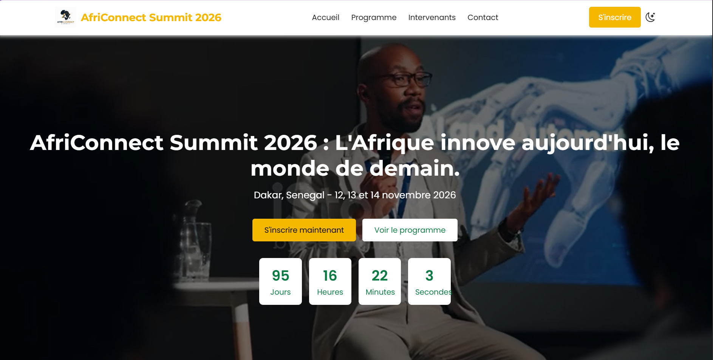

# AfriConnect Summit 2026

Nom : HAMAD EDINE IZIDINE   
Classe :L1 IAGE/NR

# Description

AfriConnect Summit 2026 est un site web vitrine pour un sommet fictif consacré à la connexion et à la collaboration entre entrepreneurs, innovateurs et investisseurs africains. Le site présente l'événement sur 4 pages : une page d'accueil avec un compte à rebours avant le sommet, une page programme organisée en onglets par journée ou thématique, une page intervenants avec un système de filtrage dynamique, et une page contact avec un formulaire de participation.

## Pages du site

 index.html — Page d'accueil avec compte à rebours avant l'événement
 programme.html — Programme du sommet organisé en onglets
 intervenants.html — Liste des intervenants avec filtrage dynamique
 contact.html — Formulaire de contact avec validation

## Fonctionnalités

 Mode sombre / mode clair (sauvegardé avec localStorage)
 Compte à rebours en temps réel avant le sommet
 Programme organisé par onglets (JS)
 Filtrage des intervenants par thème/catégorie
 FAQ en accordéon (CSS uniquement, sans JS)
 Formulaire de contact avec validation des champs

## Technologies utilisées

 HTML5 (balises sémantiques : header, nav, main, section, footer...)
 CSS3 (Grid et Flexbox pour la mise en page)
 JavaScript

## Aperçu

##  Lancer le projet localement

 https://github.com/hamadedine/-hamad-edine-izidine-Africonnectsummit

